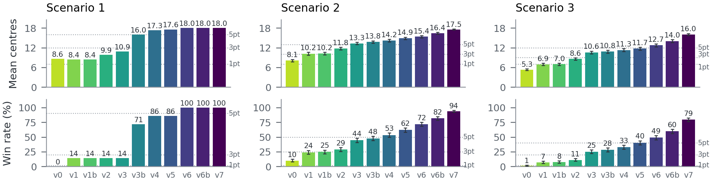

# Diplomacy Agent

TODO (Cayden): this README is a factual skeleton. Rewrite it in your own words before publishing.

An agent that plays no-press Diplomacy on the standard map, built for CITS3011 Intelligent Agents at The University of Western Australia (2026, group project).

## Results

Win rate and mean supply centres over 700 games per scenario (100 repeats x 7 starting powers, same seed for every version).

| Scenario | Opponents | Mean centres | Win rate |
| :-- | :-- | :-- | :-- |
| 1 | Static agents | 18.00 | 100% |
| 2 | Random, Greedy and Attitude agents | 17.54 | 93.9% |
| 3 | The above plus one stronger agent (our own earlier version as a stand-in) | 16.03 | 79.4% |



## How it works

- **Beam search** over one order per unit (`_beam_search`), scoring each plan by predicting its outcome and evaluating it.
- **Learnt opponent model**: per-power defence and attack rates learnt during the game (`_observe_opponents`).
- **Coordinate ascent** refinement of the beam's plan, one unit or one attack-and-support pair at a time (`_coordinate_ascent`).
- **Probabilistic outcome prediction**: each enemy unit's order as a learnt distribution, with our plan adjudicated against it exactly and scored by expected value (`_build_enemy_moves`, `_predict_outcome`).

`frozen/` holds a snapshot of the agent at each step (v0 to v7), which is what the progression figure compares.

## Layout

| Path | What it is |
| :-- | :-- |
| `agent_30.py` | The final agent |
| `test_30.py` | Experiment runner: scenarios, ablation variants, timing, calibration |
| `frozen/` | Agent snapshots v0 to v7 |
| `report/` | The project report (`report_30.pdf`) and its figures |
| `results/` | Summary results and graphs: `repeats100/` (700 games per scenario, the figures quoted above) and `repeats10/` (the earlier 70-game runs) |

## Running it

The agent runs inside the unit's game framework (baseline agents and game loop), which is the teaching staff's work and is not included here.

```
pip install -r requirements.txt
python test_30.py --quick
```

`test_30.py` writes per-game result files into `results/`. Only the summaries are kept in this repository.

## Credits

TODO: group members (with their agreement).

## Development notes

TODO: how AI assistance was used, consistent with the declaration made to the unit.
