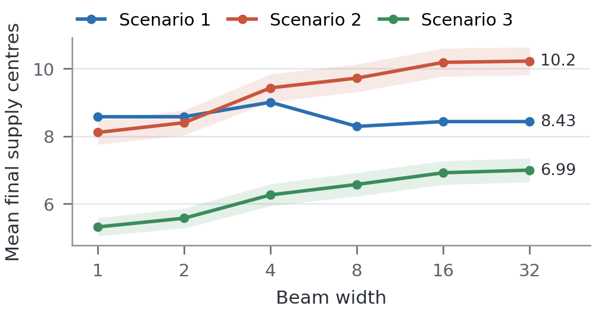
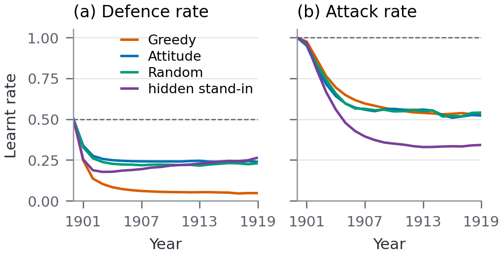
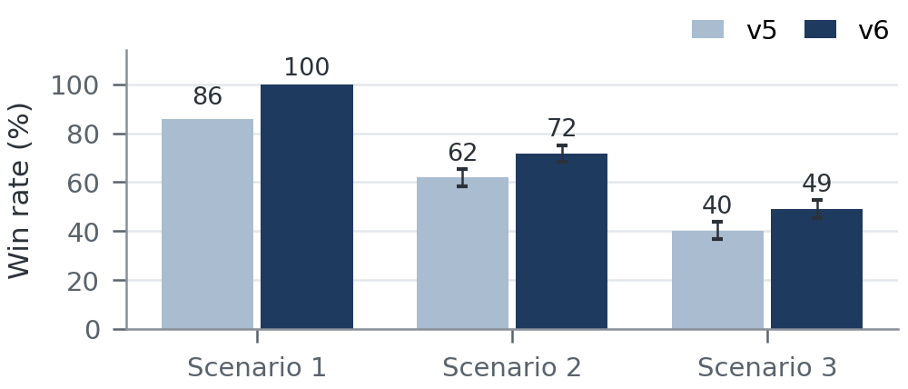
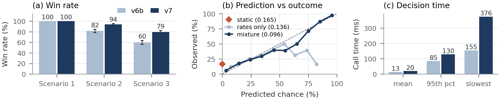

# Diplomacy Agent: Beam Search with Outcome Prediction

Project report &nbsp;-&nbsp; CITS3011 Intelligent Agents, The University of Western Australia, 2026

## Experimental Setup and Overview

We report mean supply centres and win rate (reaching 18 centres). Each version plays 100 repeats x 7 starting powers (n = 700 games) per scenario, all on base seed 3011 so line-ups and powers match across versions and differences can be compared *game by game*. Error bars are 95% CIs (normal approximation for centres, Wilson [5] for win rates). v0-v7 are frozen snapshots.

- **Scenario 1:** all Static agents. Nothing in it is random, so its 700 games are 7 *distinct* games (one per power): we give no interval for it, and a 14.3-point step is one power.
- **Scenario 2:** random mix of Random (less likely), Greedy and Attitude agents.
- **Scenario 3:** a hidden agent plus a random mix of Random, Greedy and Attitude. We use frozen v4 as the stand-in hidden agent: it wins 51.8% of Scenario 2 games (60.0, 55.7, 41.4, 50.0% over four seeds), close to the stated ~50% of the real one.

<b>Table 1.</b> Version history: mean supply centres (win rate), n = 700 games per scenario.

| Ver. | Change | Scenario 1 | Scenario 2 | Scenario 3 |
| :-- | :---------------- | :---------- | :---------- | :---------- |
| v0 | Greedy search (beam width 1) | 8.57 (0%) | 8.11 (10.0%) | 5.31 (1.4%) |
| v1 | Beam search (width 16) | 8.43 (14.3%) | 10.18 (24.1%) | 6.91 (6.9%) |
| v1b | Candidate pruning, retreat priorities | 8.43 (14.3%) | 10.22 (24.7%) | 6.97 (7.7%) |
| v2 | Separate army and fleet routes | 9.86 (14.3%) | 11.79 (29.0%) | 8.58 (11.1%) |
| v3 | Pressure | 10.86 (14.3%) | 13.31 (44.4%) | 10.56 (25.1%) |
| v3b | Learnt defence rate | 16.00 (71.4%) | 13.76 (47.7%) | 10.83 (28.1%) |
| v4 | Learnt attack rate, reach by unit type | 17.29 (85.7%) | 14.18 (53.3%) | 11.29 (32.9%) |
| v5 | Garrison | 17.57 (85.7%) | 14.90 (61.9%) | 11.71 (40.1%) |
| v6 | Coordinate ascent, candidate cap removed | 18.00 (100%) | 15.37 (71.9%) | 12.73 (49.0%) |
| v6b | Convoy handling (bug fix) | 18.00 (100%) | 16.43 (81.7%) | 14.02 (59.7%) |
| v7 | Probabilistic outcome prediction | 18.00 (100%) | 17.54 (93.9%) | 16.03 (79.4%) |

Table 1 also lists changes that are not among the three primary new techniques - these can be considered heavy heuristic improvements: *pressure* rewards units lined up next to a defended target centre, acting as a weight-based magnet paying units only up to how many are estimated-needed, and *garrison* is the mirror for our own attackable centres.
Importantly, one idea here *failed* (among several others): spreading pressure outwards as a decaying field (neutral-to-worse for 0.3 < λ < 0.7), the reason being that it values positions several turns away via this turn's defence estimate, not taking into account that the game state changes per turn-step.

<figure>

<figcaption><b>Figure 1.</b> Version progression per scenario (data from Table 1): mean supply centres (top) and win rate (bottom), with 95% CIs for Scenarios 2 and 3. Dotted lines: the rubric's 1, 3 and 5 point thresholds.</figcaption>
</figure>

## 1. Basic Technique: Greedy to Beam Search

**Method.** Each phase we choose one order per unit. The joint space (about 16 candidate orders per unit, up to 48, for as many as 17 units) is too large to enumerate, so we treat it as search: a state is a partial plan, an action gives an undecided unit one legal order, and complete plans are ranked by an evaluation function. *Greedy search* takes the best-scoring order per unit in turn and *never* revisits it. *Beam search* keeps the best `beam_width` (16) partial plans after every unit; `beam_width`=1 recovers greedy (`_beam_search`).

Units are decided neighbours-first so a support is chosen right after the unit it may support, and plans that send two units to one province, or into an own unit that is not leaving, are rejected. The deadline is checked after every unit, so a *best-so-far* plan is always available.

*Heuristic:* `_score_plan` first runs `_predict_outcome`, then `_evaluate_outcome`. In the basic version (frozen v1) the prediction is a rough estimate that ignores enemy moves this turn (a support counts only if the supported unit really does what it names; an attack bounces if its strength does not exceed the estimated defence); Section 4 replaces it. The evaluation sums weighted terms: centres captured or held, army/fleet shortest-path progress to the nearest target centre, enemy units dislodged, and penalties for failed attacks and wasted support.

<figure class="side">

<figcaption><b>Figure 2.</b> Beam width on v1's scoring (widths 1, 2, 4, 8, 16, 32): mean supply centres per scenario, 95% CI bands.</figcaption>
</figure>

**Motivation.** The branching factor rules out exhaustive search and the time limit needs an *anytime* method. Of the lecture algorithms, uniform-cost search and `A*` assume costs accumulating along a path; here all complete plans have equal depth, steps have no natural cost, and our evaluation is not an admissible cost-to-go, so `A*`'s guarantees do not apply. Greedy fits the time limit but commits *irreversibly*.

Beam search (from speech recognition [1], see also [2]) generalises it: it keeps a bounded set of alternatives, cost grows linearly with width, and width trades plan quality against time. Opponents move simultaneously, so we search only over *our own* orders and model opponents inside the evaluation (Sections 2 and 4). The implementation is our own.

**Evaluation.** Greedy v0 averaged 8.11 centres with 10.0% wins in Scenario 2 and 5.31 with 1.4% in Scenario 3. Beam search (v1: width 16, same scoring) raised wins to 24.1% and 6.9%, a paired gain on the same games of **2.07 ±0.29** and **1.60 ±0.27** centres (Table 1, Fig. 1). In Scenario 1 centres are level (8.57 to 8.43) but one of the seven powers now wins; it is seven deterministic games, so only Scenarios 2 and 3 show a trend. Fig. 2 sweeps the width on v1: centres rise steadily from width 1 to 16 and then *flatten*, with width 32 adding 0.04 and 0.08 centres, well inside the ±0.4 interval. The cost is time: the mean call is 0.7 ms at width 1, 4.3 ms at 16 and 8.1 ms at 32, so we keep 16 and leave the remaining budget to the later techniques.

## 2. New Technique 1: Learnt Opponent Model

<figure class="side">

<figcaption><b>Figure 3.</b> What v7's opponent model learns in Scenario 3, by the type of agent behind each power (mean over 700 games). Dashed line: the prior.</figcaption>
</figure>

**Method.** After each movement phase, `_observe_opponents` counts, per opponent and using each unit type's own routes, opportunities and actions for two behaviours.

- **Defence:** the unit could support a hold of one of its own units, or move back into one of its own empty centres, and *does*.
- **Attack:** the unit could move into ground we hold (owned centre or province), and *does*.

Rates use a beta-binomial estimate [3], rate = (done + prior x 3) / (opportunities + 3), with priors 0.5 (defence) and 1.0 (attack) so *one* early turn cannot swing it (`_rate`). Note: attack priors of 0.5, 0.75, 1.0 scored level over eight seeds, so we kept the cautious one. The defence rate sets each enemy unit's defence strength (one plus the rate for each same-power unit that could support the hold), hence how many attackers are needed to dislodge it (`_enemy_defence_strength`). The attack rate (v4) sets the attack strength each of our centres may face, hence how many defenders it needs (`_enemy_attack_strength`), and later supplies the enemy move rate/order predictions of Section 4.

**Motivation.** Early versions assumed an enemy unit able to support a hold does so about half the time. Against the baselines this is badly wrong: it inflates the attackers the planner thinks it needs, so it *waits and consolidates* instead of attacking. A one-line trial lowering the assumed rate to 0.25 lifted Scenario 1 from 10.86 to **16.00** centres (14.3% to **71.4%** wins).

A hand-set constant is just tuning to the baselines and would be wrong against an opponent that *does* defend, as the hidden agent may, so we learn the rates *online*, per opponent (Fig. 3).

**Evaluation.** The learnt defence rate (v3b) matched the hand-set trial on the baselines (71.4% in Scenario 1, 47.7% in Scenario 2) while remaining *adaptive*. Fig. 3 shows the model is doing more than tuning: within about five years it separates Greedy (defence rate near 0.06) from Attitude and Random (0.22 to 0.24), and by 1910 the hidden stand-in's attack rate (0.35) from the baselines' (about 0.55), which no single constant could match. Adding the attack rate and unit-type reach (v4) raised win rates by **5 to 14 points** (Scenario 1: 71.4% to 85.7%; Scenario 2: 47.7% to 53.3%; Scenario 3: 28.1% to 32.9%). v4 also made enemy reach depend on unit type, so this gain bundles *two* changes.

## 3. New Technique 2: Coordinate Ascent Refinement

**Method.** After the beam returns its best plan, we repeat until no change improves the score or the deadline passes (`_coordinate_ascent`): (i) for each unit, try its alternative orders and keep the best; (ii) for each attack and its supporters, try replacing the pair (a different attack with matching support). Only *strict* improvements are accepted, so that the loop ends at a local optimum (no restarts). The 16-order candidate cap and pruning are removed to use the time budget.

This is *coordinate ascent*, the maximising form of coordinate descent [4]: each unit's order is a coordinate, the attack-plus-support move updates two coordinates at once as block-coordinate methods do, and the loop is standard hill climbing [2].

**Motivation.** Beam search fixes each unit's order once, scored against a partial plan, so the value of a coordinated pair (an attack and the support that makes it succeed) is only visible if *both* happen to be chosen together. *Alone*, removing the candidate cap changed nothing (on v5, Scenario 2 over four seeds, n = 280: 15.11 centres with the cap, 14.85 without), so the limitation is the *search procedure*, not the *candidate set*: the extra candidates pay only once the search (ascent) can use them. We therefore refine the finished plan with local search.

<figure class="side">

<figcaption><b>Figure 4.</b> Coordinate ascent, v5 vs v6: win rate per scenario with 95% CIs.</figcaption>
</figure>

**Evaluation.** v6 won 100% of Scenario 1 games (v5: 85.7%), **71.9%** of Scenario 2 (61.9%) and **49.0%** of Scenario 3 (40.1%), with mean centres 18.00, 15.37 and 12.73 (v5: 17.57, 14.90, 11.71; Fig. 4), a paired gain of **0.48 ±0.30** and **1.01 ±0.40** centres in Scenarios 2 and 3. Games v6 did not win in Scenario 2 finished well short of 18 (mean 8.7), not as *near misses*.

Decision time rose: mean per call went from 7.6ms (v5) to 12.7ms (v6), p95 from 42ms to 90ms, and the slowest call in any v6 game was 310ms, inside the 600ms budget with no call over the 1s limit. Out of 442 measured turns, the anytime budget cut the search short in only 1, so it nearly always converges *on its own*.

## 4. New Technique 3: Probabilistic Outcome Prediction

The largest of the three new techniques, in both code and gain.

**Method.** Before each movement phase is searched, `_build_enemy_moves` gives every enemy unit a distribution of chances over the orders it may give next, using three more rates learnt per power (counted in `_observe_opponents`, as in Section 2). This is what moves our agent from planning against a frozen board with one assumed outcome to planning against a predicted one with its *expected* outcome.

- **Repeat** (prior 0.3): a unit that has not moved gives last turn's order again, since a bounced attack is often just retried.
- **Greedy** (prior 0.6): the unit steps along a shortest route of its own unit type towards the nearest centre the power does not own (`_greedy_steps`).
- **Move** (prior 0.5): the unit moves *at all*, rather than supporting, holding or convoying.

The three are applied *in turn*: repeat, then greedy, then usual behaviour (onto our ground at its attack rate, anywhere else reachable at its move rate, split evenly and scaled down to a total of one).
Applying them in turn as a mixture model, each on what the last left over (as a weight remainder), is what keeps a given unit's chances summing to <= 1 *without* any normalising step, further allowing a power's strong repeat or greedy habit to crowd out weaker guesses. Any remainder naturally encodes the chance the unit holds.

We can now leverage two tables that come out of this.

- `enemy_entry_chances_at` holds, per province, the chance each enemy unit is ordered to move or support a move into it.
- `enemy_stay_chance_at` holds, per enemy unit, the chance the unit remains in place once the turn resolves. The stay chance includes attempted leaves into bounces (assumed 0.8 into occupied ground, 0.1 into empty, `bounce_chances`) - important since such a unit *still defends* its province.

Enemy units are treated as independent, so the number of them pushing into one province is Poisson-binomial, and `_chance_at_least` returns P(enemy strength >= n) *exactly*, via bottom-up dynamic programming over the units (no sampling). Additionally, exact chances keep the score of a plan repeatable - vital for Section 3: coordinate ascent accepts strict improvements only, and sampling noise would have it accept changes that are not real.

`_predict_outcome` then resolves our own plan against these chances, one game rule at a time. Units the plan has not reached yet are assumed to hold (can be thought of as a partial plan padded with holds), so that every partial plan in the beam is scored on the *whole* board and not only on units decided so far.

- **Support cut:** a support of ours stands unless an enemy moves onto the supporter, excluding the unit being attacked, as it cannot cut a support against itself (`_support_standing_chances`).
- **Move success:** averaged over how many supports stand, our move has to beat the defender (its learnt defence strength, or nothing if it left) and must not meet an enemy pushing into the same province at least as hard (`_move_success_chance`).
- **Dislodgement:** a unit of ours that holds is pushed off when enemy strength exceeds one plus its uncut supports (`_dislodge_chance`).

Therefore, the result is no longer a predicted board, but a *superposed* one: each one of our units is placed in every province it *may* end the turn in, with a chance on each (`PredictedOutcome.unit_ends`). A moving unit, for example, is at both its destination with its success chance and back at its origin with the remainder. Note: these are per-unit *marginals* and not a distribution over whole boards, which is all the score needs, since it is a sum of per-unit terms (linearity of expectation).

`_evaluate_outcome` now weights each positional term (centre taken or kept, progress, pressure, garrison) by the chance the unit ends there, and adds four terms that only exist now that enemies move: `lose_centre` (Fall) and `expose_centre` (Spring) for centres left empty that may be entered, `lose_unit` for a unit pushed off its province, and `block_build` for a safe home centre left occupied. All chances are cached/memoised per turn (`chance_cache`), since the search scores thousands of plans against the same prediction.

Predicting another agent's moves from its observed behaviour is *policy reconstruction* [6]. The three-behaviour mixture model, the exact adjudication and the scoring of plans by expectation are our own.

**Motivation.** Up to v6b, `_predict_outcome` was *deterministic* and *blind* to enemy moves this turn: a move into an empty centre always got in, a support was never cut, and a centre we walked away from was never taken. Actual turns are contested, so fragile plans were overrated, and a covered centre looked no different to an exposed one. Section 2 only partly helps here, as it gives each centre the strength of its strongest neighbouring power and not the combined threat.

The usual alternatives serve as poor fits. Minimax assumes one opponent with opposite interests, but we face six that are *not* a coalition, so guarding against the worst case of all six is far too defensive. Sampling enemy orders (Monte Carlo) makes every score noisy and blows through the 1s limit via simulations. We therefore predict each enemy unit's order as a learnt distribution and adjudicate our plan against it *exactly*, so that a plan's score is its expected value/utility.

**Evaluation.** v7 won **93.9%** of Scenario 2 games (v6b: 81.7%) and **79.4%** of Scenario 3 (59.7%), a paired gain of **1.11 ±0.30** and **2.01 ±0.41** centres on the same 700 games, with Scenario 1 already at 100% (Fig. 5a). This is the *largest* step of the three techniques. Note: v7 also carries two rule fixes found while writing the adjudication (a move into our own holding unit, and two retreats into one province), worth about 0.06 and 0.19 of those centres over eight seeds.

The prediction itself was checked against the orders enemies then gave (Fig. 5b, about 208,000 predictions over 140 games of Scenarios 2 and 3). A predicted 90-100% came true 97% of the time, 80-90% came true 87%, and 10-20% came true 18%. It is *over-confident* between 50% and 70% (39-50% observed), where a repeat or greedy guess is right less often than its rate says. Its Brier score is **0.096**, against 0.136 with repeat and greedy switched off, where the few confident predictions are mostly wrong (16-39% observed for a predicted 60-90%), and 0.165 for what v6b assumed, that every enemy unit stays put (the same predictions scored at 0%). In play, switching them off cost about 0.9 centres and ten points of win rate in each of Scenarios 2 and 3 (same 70 games each), so much of the gain is from predicting *where* units go and not only *how often* they move.

Decision time rose: mean per call went from 13ms (v6b) to 20ms (v7), and the slowest Scenario 2 call from 155ms to 376ms, still inside the 600ms budget (Fig. 5c). A learnt support rate was also tested and left out, as it did not help (+0.04 ±0.14 and 0.00 ±0.28 centres over eight seeds). Limits: the bounce chances are fixed guesses, and the agent still only looks *one* turn ahead.

<figure>

<figcaption><b>Figure 5.</b> Probabilistic outcome prediction. (a) Win rate per scenario, v6b vs v7, with 95% CIs. (b) Predicted chance that an enemy unit moves or supports into a province against how often it did, in tenths, Scenarios 2 and 3: the full mixture, the usual rates alone, and enemies assumed static as in v6b (one point, always 0%). Brier score in brackets, lower is better. (c) Call time in Scenario 2.</figcaption>
</figure>

## References

1. Lowerre, B. T. (1976). *The HARPY Speech Recognition System.* PhD thesis, Carnegie Mellon University.
2. Russell, S. and Norvig, P. (2020). *Artificial Intelligence: A Modern Approach* (4th ed.). Pearson. Sections 3.5 (beam search) and 4.1 (hill climbing, local beam search).
3. Murphy, K. P. (2012). *Machine Learning: A Probabilistic Perspective.* MIT Press (Beta-Binomial model).
4. Wright, S. J. (2015). Coordinate descent algorithms. *Mathematical Programming*, 151(1), 3-34.
5. Wilson, E. B. (1927). Probable inference, the law of succession, and statistical inference. *JASA*, 22(158), 209-212.
6. Albrecht, S. V. and Stone, P. (2018). Autonomous agents modelling other agents: A comprehensive survey and open problems. *Artificial Intelligence*, 258, 66-95.
7. Diplomacy game engine (`diplomacy` Python package), github.com/diplomacy/diplomacy, and the provided baseline agents (course materials).
